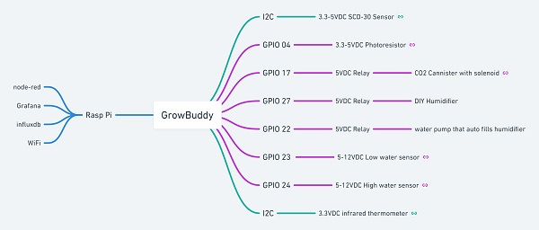
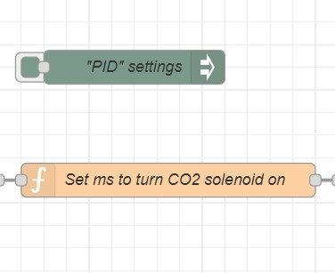

# Useful pages
- [ToDos](pages/todos.md)
- [Tasmota learnings](pages/Tasmota_learnings.md)
- [mqtt on rasp pi learnings](pages/mqtt_learnings.md)
- [wiring thoughts](WIRING_and_connectors.md)
- [flashing SONOFF S31 devices for local Tasmota](pages/flashing_SONOFF_S31.md)
# What is GrowBuddy?
GrowBuddy:


_The [drawing in Whimisical](https://whimsical.com/growbuddy-FeXJ723nJx8YGJT4TGzWy7) includes links of interest._

Includes:
- __The Growbuddy Guide__
    A smartphone app that guides the grower through every step of the grow stage and supports journaling of what happened each day as well as a way to send questions.
- __The Director__
    The Director is a __Raspberry Pi__ running:
    - mosquitto mqtt broker
    - influxdb
    - node-red
    It's called __The Director__ because it acts as the "brains" and storage unit.  node-red is the code acting as the brains.  It:
    - Takes in mqtt messages sent by the Buddies.
    - Records the sensor readings into influxdb.
    - Understands best practices on humidity, light for optimum grow based on the growth stage the plants are in.d
- Buddies Built on Tasmota

    [Tasmota](https://tasmota.github.io/docs/) simplifies setting up home automations because it is fairly straightforward to get a sensor, switch, relay running Tasmota to be controlled.  It assumes an ESP286 or ESP32 CPU.  Once installed, you connect it to your home's wifi.  Once configured, mqtt messages can be published.

    [Tasmota learnings](pages/Tasmota_learnings.md)
    
- The __Sniffer Buddy__ 

    Plug it in and __The Sniffer Buddy__:

    -  Reads the air temperature, humidity, and CO2 level. 
    -  Reads the value of a photoresitor mounted on top of the enclosure.  This gives __The Director__ a second source (besides a light timer) to determine if the LED grow lights are on or off.

    The readings are published via mqtt.

    [__The Sniffer Buddy__ in depth](pages/SNIFFER_BUDDY.md)

- The __FillerUp Buddy__

    Plug it in and the FillerUp Buddy will automatically detect when the water level in the humidifier is low.  It will request a __Plug Buddy__ to turn on the water pump it is attached to whent it is low and turn off the pump when the high water level mark is reached.

    [__The FillerUp Buddy__ in depth](pages/FILLERUP_BUDDY.md)

- The __Plug Buddy__ 
    - a Sonoff S31 (most likely S31 lite) modified to work within a local Tasmota environment.

- The __Light Buddy__
TBD: PAR meter perhaps auto adjust of lights.

------------------------------------------------------------------
EDITING BELOW....
# The Director
node-red is used to manage everything.  The flows get readings from the Sniffer and FIllerUp Buddies.  Then it uses Plug Buddies to adjust the amount of CO2 and humidity.

 _NOTE: I found node-red to be a simple and powerful way to code up all incoming/outgoing activities as well as provide "smarts" such as given a grow state (e.g. Vegetative versus Flowering), how much CO2 to add and what humidity level should the grow tent space be at._
 
 [__The Director__ in depth](pages/DIRECTOR.md)


# Setpoints

The setpoints used for adjusting CO2 and VPD/humidity come from the [Fluence Cannabis Cultivation Guide](docs/FLU-CultivationGuide_Cannabis_WEB_PROOF_01-2020.pdf) from 2020.  These are stored in influxdb.  The table name is `CO2_setpoints`
- __PPFD__ from Figure 2, page 8.  _Note: The PPFD is not automated.  However, I use these numbers to adjust the grow lights._
- __CO2 enrichment level__ evolves from Figures 7 and 8, page. 14.  The settings I use:
    - No enrichment during germination (~ first two weeks).
    - 800 ppm while in vegetative (~ two months starting after germination).
    - 1200 ppm while in flowering (~ two months starting after vegetative)
- __VPD level__ The VPD level is calculated and used to adjust the humidity.  While VPD involves both (air and leaf temperature) and humidity, I do not adjust the temperature.  Just the humidity.  How the VPD is calculated is discussed under [Calculate the VPD](#calculate-the-vpd)


## Software (Raspberry Pi)
A __Raspberry Pi__ running __node-red__, __influxdb__, and __Grafana__ controls, stores, and monitors/graphs CO2, humidity, and air temperature.



[Source](https://whimsical.com/growbuddy-LAHevcjLgqGTK7hZa98vjn)

The node-red code is located [at this GitHub location](https://github.com/solarslurpi/node-red-leafspa).

Here is an example of what __Grafana__ displays based on values stored in __influxdb__:


And here is an example of one of the __node-red__ flows:


## Peripherals
The Raspberry Pi interacts with:
- A __[SCD-30 sensor](https://www.adafruit.com/product/4867)__ that reads the CO2 concentration, air temperature, and relative humidity.  
    - The SCD-30 uses 3 VDC and speaks to the Raspberry Pi over an I2C interface.
- A __[photoresistor](https://smile.amazon.com/gp/product/B07S683LRT/ref=ppx_yo_dt_b_search_asin_title?ie=UTF8&psc=1)__ that gives me confidence the system knows when the LED lights are on or off.  The Rasp Pi doesn't have an ADC, thus this instead of a simple photoresistor.  
- __[Two water sensors](https://smile.amazon.com/gp/product/B07FC5RGC7/ref=ppx_yo_dt_b_search_asin_title?ie=UTF8&psc=1)__ that I stick on the side of the container holding water for the humidifier at the high and low water thresholds.  These are supposed to use 5-24VDC.  However, I used GPIO pins and 3VDC.
- __Three relays__ are used to turn the CO2 solenoid on and off, turn the humidifier on and off, and one to turn the water pump on and off that delivers water to the humidifier. Each relay uses a GPIO pin.  The physical relays reside within a 3 set power outlet.  This way, the appliances being turned on and off maintain their power cords.
- _ToDo: Infrared for leaf temperature_ I use VPD to figure out how much humidity is needed.  The VPD calculation requires the leaf temperature.  Currently, I just subtract 2 degrees F from the air temperature.  That is, I approximate.  I am exploring adding [an IR thermometer](https://smile.amazon.com/gp/product/B071VF2RWM/ref=ppx_yo_dt_b_asin_title_o00_s00?ie=UTF8&psc=1)


## Code Behind The Tasks
Each automated task has it's own (node-red)flow.  The code is located in [this github repository](https://github.com/solarslurpi/node-red-leafspa).
### Read SCD Sensor


The SCD Sensor senses the CO2 level, relative humidity, and air temperature.  It is read every few seconds.    Each reading is checked for errors.
#### Reading Errors
There is a global variable, `global.sensor_working` that is used within the (node-red) flows to control whether a reading should be used in the CO2 or humidity adjustments.
- The SCD Sensor throws an error if the I2C connection is not working.  This [error is catchable](https://nodered.org/docs/user-guide/handling-errors) at runtime.
- The other errors check what the values are and determines if they are valid.

Both types of errors are handled within the (node-red) Sensor Error `Check Subflow`.  If there is an error, `global.sensor_working` is set to `false`.
##### Valid Readings
If the reading is valid, `global.sensor_working` is set to `true`. To minimize noise, a sliding window of 10 values is used to average out the noise.  The averaged readings are then put into the global variables `global.CO2`, `global.temperature`, and `global.humidity`.
##### Invalid Readings
If the readings are not valid, `global.sensor_working` is set to `false` and the number of bad readings is tracked.
### Adjust CO2 Level
The CO2 level adjustment section of code gets called every 30 seconds.

_TBD: I do not detect the amount of CO2 in a tank.  Knowing this would be useful in alerting me when I need to refill the CO2 tank.  With that said, I get a rough idea over time based on the size of the tank when refilling will occur.  Thus, this feature is a low priority._


[Source](https://whimsical.com/adjust-co2-level-3oTnu5rQ7CTUTeLPvVAv3k)

#### Time to Adjust CO2 Level?

CO2 concentration correction DOES NOT occur when:
- Maintenance is TRUE (`global.maintanence == true`)
- Readings are not valid (`global.sensors_working == false`)
- Lights are OFF (`global.CO2_ON == true`)
- Lights have been on for less than 30 minutes (`gloval.CO2_ON == true`)
#### Figure out # Secs to Turn CO2 Solenoid On
Here I use a simple PID algorithm. _Note: I have no training in PID controls._ The two node-red nodes that are used:



#### PID Settings
PID Settings is a config node.  The settings for Kp, Ki, and Kd came after a few hours of experimentation.  Besides the CO2 reading - which is in the global variable `CO2`, the variables used to control the CO2 PID include:


```
current_CO2 = global.get("CO2");
setpoint_CO2 = flow.get("setpoint_CO2");
// Calculate the error term
error = setpoint_CO2 - current_CO2;
// Calculate the Proportional Correction
Kp = flow.get("Kp");
pCorrection = flow.get("min_CO2_on")*Kp*error;
// Calculate the Integral Correction
cum_error = flow.get("cum_error")+error;
flow.set("cum_error",cum_error);
iCorrection = (cum_error*flow.get("Ki"));
iCorrection = iCorrection - iCorrection % 1;
// Calculate the Derivative Correction
last_error = flow.get("last_error");
slope = error - last_error;
dCorrection = slope*flow.get("Kd");
dCorrection = dCorrection - dCorrection % 1;
flow.set("last_error",error);
// Calculate the # Seconds to turn CO2 on
num_CO2_seconds = pCorrection + iCorrection + dCorrection;
// Clamp the Correction to not exceed a maximum 
max_CO2_seconds = 20;
min_CO2_seconds = 0;
if (num_CO2_seconds > max_CO2_seconds){
    num_CO2_seconds = max_CO2_seconds;
}else if (num_CO2_seconds < min_CO2_seconds) {
    num_CO2_seconds = min_CO2_seconds;
}
// Write stuff out to the debug window.
node.warn("current CO2 = " + current_CO2 + " Error: = "+ error);
node.warn("**>> pCorrection is "+pCorrection+" iCorrection is "+iCorrection);
node.warn("******** dCorrection is "+dCorrection);
node.warn("**** slope is " + slope);
node.warn("**** Num CO2 seconds is "+num_CO2_seconds);
msg.delay = num_CO2_seconds*1000 ;
msg.payload = msg.delay;
return msg;
```
#### Turn the CO2 valve on for # Seconds
The node-red software uses the number of seconds calculated to turn on and off the relay controlling the CO2 solenoid.
### Adjust VPD
With the LED lights on, the indoor grow temperature is between 75 and 80 degrees F.  Because of this, the temperature is not adjusted.  However, the humidity is adjusted to align with ideal VPD calculations.
<iframe style="border:none" width="800" height="450" src="https://whimsical.com/embed/W9AGKZYLEZiiAQnKKjgwmy"></iframe>

#### Calculate the VPD<a name="VPD_calc"></a>

If `global.sensor_working == true`, the VPD is calculated:
```
var air_T = global.get("temperature");
/* Assume leaf temp is 2 degrees F less */
var leaf_T = air_T - 2;
var RH = global.get("humidity");

/* see https://www.questclimate.com/vapor-pressure-deficit-indoor-growing-part-3-different-stages-vpd/ */
leaf_vpd = 3.386*(Math.exp(17.863-9621/(leaf_T+460))-((RH/100)*Math.exp(17.863-9621/(air_T+460))));
msg.payload = Number(leaf_vpd.toFixed(2));
msg.topic = "vpd"
flow.set("vpd",msg.payload)
return msg;
```
#### Time to Adjust VPD?
The [algorithm used is from a Quest website](https://www.questclimate.com/vapor-pressure-deficit-indoor-growing-part-3-different-stages-vpd/).  In the code above, the leaf temperature (`leaf_T`) is set to be 2 degrees F less than the air temperature.  This approximation is used when there is not IR thermometer pointed at a leaf.  I do not have an IR thermometer in my current prototype.  I plan on adding one once I can figure out how I want to make sure I get accurate measurements of the leaf temperature.

If


