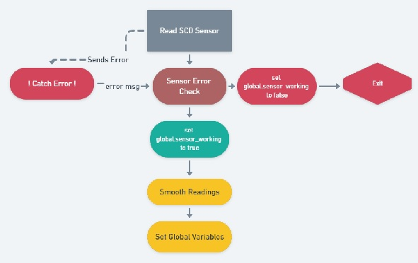
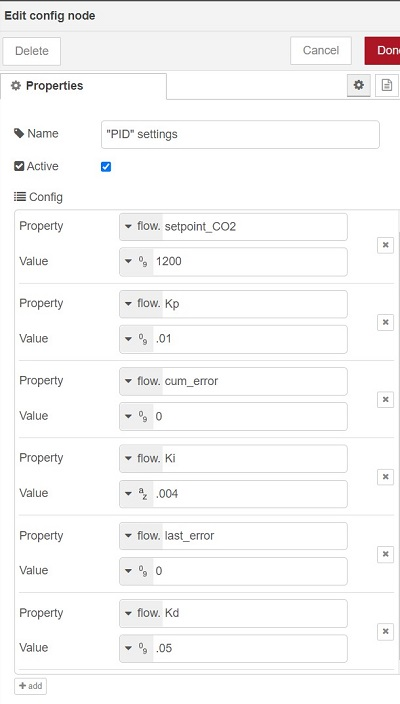

# What is GrowBuddy?
I am building GrowBuddy to work with my indoor grow.  I am intrigued to find out how much "care and feeding" of indoor plants can be done with technology.  With that said, when I am home I will always check up on my plants daily.  I just love the idea of having a "little buddy" helping me.  There are three distinct GrowBuddy "jobs".


1. __(GrowBuddy)__ At present GrowBuddy automates the task of:
- __Adjusting the CO2 level__ to the ideal level based on lights on/off.
- __Adjusting the humidity level__ to the ideal VPD level.

given which growth stage the plants are in and whether lights are on or off.

I don't adjust the temperature because where I live the temperature stays within a reasonable level for the plants to thrive.

I provide air flow by linking several PC fans together.  The fans run 7/24.

Light is provided by an LED setup.  Lighting is not automated.  I guess I could set up a system that figured out the current height of the canopy and then adjusted the LED distance.  But for now I don't.

2. __(Doctor GrowBuddy)__ Uses camera and machine learning to aid in plant stress diagnosis.

3. __(GrowBuddy Journal)__ Journal daily growth metrics and publish to online growing diaries.
# GrowBuddy Overview
GrowBuddy:
- Adjusts the CO2 level.
- Adjusts the humidity level.
- Refills the container holding water for the humidifier.

GrowBuddy does not: 
- Automate air circulation and ventilation.  I haven't seen a need to.  Rather, I add fans to circulate the air around the plant leaves.  For ventilation, I provide input and exhaust fans.
- Adjust the temperature.  The grow tent temperature typically ranges between 75 and 80 degrees without adjustment.
- Automate the PPFD value for the canopy.  I do this by adjusting the lights higher or lower.
- Automate irrigation.  Rather I choose to use the Blumat system of watering.


<iframe style="border:none" width="800" height="450" src="https://whimsical.com/embed/LAHevcjLgqGTK7hZa98vjn"></iframe>

## Raspberry Pi
A __Raspberry Pi__ running __node-red__, __influxdb__, and __Grafana__ controls, stores, and monitors/graphs CO2, humidity, and air temperature.

The node-red code is located [at this GitHub location](https://github.com/solarslurpi/node-red-leafspa).

Here is an example of what __Grafana__ displays based on values stored in __influxdb__:


And here is an example of one of the __node-red__ flows:


## Peripherals
The Raspberry Pi interacts with:
- A __[SCD-30 sensor](https://www.adafruit.com/product/4867)__ that reads the CO2 concentration, air temperature, and relative humidity.  
    - The SCD-30 uses 3 VDC and speaks to the Raspberry Pi over an I2C interface.
- A __[photoresistor](https://smile.amazon.com/gp/product/B07S683LRT/ref=ppx_yo_dt_b_search_asin_title?ie=UTF8&psc=1)__ that gives me confidence the system knows when the LED lights are on or off.  The Rasp Pi doesn't have an ADC, thus this instead of a simple photoresistor.  
- __[Two water sensors](https://smile.amazon.com/gp/product/B07FC5RGC7/ref=ppx_yo_dt_b_search_asin_title?ie=UTF8&psc=1)__ that I stick on the side of the container holding water for the humidifier at the high and low water thresholds.  These are supposed to use 5-24VDC.  However, I used GPIO pins and 3VDC.
- __Three relays__ are used to turn the CO2 solenoid on and off, turn the humidifier on and off, and one to turn the water pump on and off that delivers water to the humidifier. Each relay uses a GPIO pin.  The physical relays reside within a 3 set power outlet.  This way, the appliances being turned on and off maintain their power cords.
- _ToDo: Infrared for leaf temperature_ I use VPD to figure out how much humidity is needed.  The VPD calculation requires the leaf temperature.  Currently, I just subtract 2 degrees F from the air temperature.  That is, I approximate.  I am exploring adding [an IR thermometer](https://smile.amazon.com/gp/product/B071VF2RWM/ref=ppx_yo_dt_b_asin_title_o00_s00?ie=UTF8&psc=1)

## Code Behind The Tasks
Each automated task has it's own flow.
### Read SCD Sensor


The SCD Sensor senses the CO2 level, relative humidity, and air temperature.  It is read every few seconds.    Each reading is checked for errors.
#### Reading Errors
There is a global variable, `global.sensor_working` that is used within the (node-red) flows to control whether a reading should be used in the CO2 or humidity adjustments.
- The SCD Sensor throws an error if the I2C connection is not working.  This [error is catchable](https://nodered.org/docs/user-guide/handling-errors) at runtime.
- The other errors check what the values are and determines if they are valid.

Both types of errors are handled within the (node-red) Sensor Error Check Subflow.  
##### Valid Readings
If the reading is valid, `global.sensor_working` is set to true. To minimize noise, a sliding window of 10 values is used to average out the noise.  The averaged readings are then put into the global variables `global.CO2`, `global.temperature`, and `global.humidity`.
##### Invalid Readings
If the readings are not valid, `global.sensor_working` is set to false and the number of bad readings is tracked.
### Adjust CO2 Level
_TBD: I do not detect the amount of CO2 in a tank.  Knowing this would be useful in alerting me when I need to refill the CO2 tank.  With that said, I get a rough idea over time based on the size of the tank when refilling will occur.  Thus, this feature is a low priority._
<iframe style="border:none" width="800" height="450" src="https://whimsical.com/embed/3oTnu5rQ7CTUTeLPvVAv3k"></iframe>

#### Time to Adjust CO2 Level?

CO2 concentration correction DOES NOT occur when:
- Maintenance is TRUE (`global.maintanence == true`)
- Readings are not valid (`global.sensors_working == false`)
- Lights are OFF (`global.CO2_ON == true`)
- Lights have been on for less than 30 minutes (`gloval.CO2_ON == true`)

#### Read and Average Values
The SCD-30 sensor is read every 3 seconds to get the CO2 level.  To minimize noise, a sliding window of 10 values is done before using a CO2 level reading in a calculation.
### Figure out # Secs to Turn CO2 Solenoid On
Here I use a simple PID algorithm.  The two node-red nodes that are used:


#### PID Settings
PID Settings is a config node.  The settings for Kp, Ki, and Kd came after a few hours of experimentation.  Besides the CO2 reading - which is in the global variable `CO2`, the variables used to control the CO2 PID include:



```
current_CO2 = global.get("CO2");
setpoint_CO2 = flow.get("setpoint_CO2");
// Calculate the error term
error = setpoint_CO2 - current_CO2;
// Calculate the Proportional Correction
Kp = flow.get("Kp");
pCorrection = flow.get("min_CO2_on")*Kp*error;
pCorrection = pCorrection - pCorrection % 1;
// Calculate the Integral Correction
cum_error = flow.get("cum_error")+error;
flow.set("cum_error",cum_error);
iCorrection = (cum_error*flow.get("Ki"));
iCorrection = iCorrection - iCorrection % 1;
// Calculate the Derivative Correction
last_error = flow.get("last_error");
slope = error - last_error;
dCorrection = slope*flow.get("Kd");
dCorrection = dCorrection - dCorrection % 1;
flow.set("last_error",error);
// Calculate the # Seconds to turn CO2 on
num_CO2_seconds = pCorrection + iCorrection + dCorrection;
// Clamp the Correction to not exceed a maximum 
max_CO2_seconds = 20;
min_CO2_seconds = 0;
if (num_CO2_seconds > max_CO2_seconds){
    num_CO2_seconds = max_CO2_seconds;
}else if (num_CO2_seconds < min_CO2_seconds) {
    num_CO2_seconds = min_CO2_seconds;
}
// Write stuff out to the debug window.
node.warn("current CO2 = " + current_CO2 + " Error: = "+ error);
node.warn("**>> pCorrection is "+pCorrection+" iCorrection is "+iCorrection);
node.warn("******** dCorrection is "+dCorrection);
node.warn("**** slope is " + slope);
node.warn("**** Num CO2 seconds is "+num_CO2_seconds);
msg.delay = num_CO2_seconds*1000 ;
msg.payload = msg.delay;
return msg;
```
#### Turn the CO2 on for # Seconds
The node-red software uses the number of seconds calculated to turn on and off the relay controlling the CO2 solenoid.
### Humidity Correction
With the LED lights on, the indoor grow temperature is between 75 and 80 degrees F.  Because of this, the temperature is not adjusted.  However, the humidity is adjusted to align with ideal VPD calculations.
