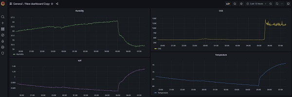

# What is GrowBuddy?
I am building GrowBuddy to work with my indoor grow.  I am intrigued to find out how much "care and feeding" of indoor plants can be done with technology.  With that said, when I am home I will always check up on my plants daily.  I just love the idea of having a "little buddy" helping me.  There are three distinct GrowBuddy "jobs".

1. __(GrowBuddy)__ At present GrowBuddy automates the task of:
- __Adjusting the CO2 level__ to the ideal level based on lights on/off
- __Adjusting the humidity level__ to the ideal VPD level

given which growth stage the plants are in and whether lights are on or off.

I don't adjust the temperature because where I live the temperature stays within a reasonable level for the plants to thrive.

I provide air flow by linking several PC fans together.  The fans run 7/24.

Light is provided by an LED setup.  I don't automate lighting.  I adjust PPFD by hand.  I guess I could set up a system that figured out the current height of the canopy and then adjusted the LED distance.  But for now I don't.

2. __(Doctor GrowBuddy)__ Uses camera and machine learning to aid in plant stress diagnosis.

3. __(GrowBuddy Journal)__ Journal daily growth metrics and publish to online growing diaries.
# GrowBuddy Overview
GrowBuddy:
- Adjusts the CO2 level.
- Adjusts the humidity level.
- Refills the container holding water for the humidifier.

<iframe style="border:none" width="800" height="450" src="https://whimsical.com/embed/LAHevcjLgqGTK7hZa98vjn"></iframe>

## Hardware and Software
- A __Raspberry Pi__ running __node-red__, __influxdb__, and __Grafana__ controls, stores, and monitors/graphs CO2, humidity, and air temperature.

Here is an example of what __Grafana__ displays based on values stored in __influxdb__:

And here is an example of one of the __node-red__ flows:

The Raspberry Pi interacts with:
- A [SCD-30 sensor](https://www.adafruit.com/product/4867) that reads the CO2 concentration, air temperature, and relative humidity.
- [Two water sensors](https://smile.amazon.com/gp/product/B07FC5RGC7/ref=ppx_yo_dt_b_search_asin_title?ie=UTF8&psc=1) that I stick on the side of the container holding water for the humidifier at the high and low water thresholds.
- A [photoresistor that works with the Rasp Pi](https://smile.amazon.com/gp/product/B07S683LRT/ref=ppx_yo_dt_b_search_asin_title?ie=UTF8&psc=1).  The Rasp Pi doesn't have an ADC, thus this instead of a simple photoresistor.
- Three relays used to turn the CO2 solenoid on and off, turn the humidifier on and off, and one to turn the water pump on and off that delivers water to the humidifier. 

### Air Circulation and ventilation
I don't automate.  Rather, I add fans to circulate the air around the plant leaves.  For ventilation, I provide input and exhaust fans.
### Humidity, Temperature, and CO2 Concentration
This is the stuff I automate using sensors and stuff like a humidifier and CO2 cannister - referred to from now on as "appliances".  The sensors tell the system what the values are.  The system then either turns on or off the appliance to adjust the value within an acceptable range.
#### Sensors
- CO2 concentration, air temperature, humidity: For my prototype, I used the [SCD-30](https://www.adafruit.com/product/4867).
- Light ON and OFF: The [photoresistor](https://smile.amazon.com/gp/product/B07S683LRT/ref=ppx_yo_dt_b_search_asin_title?ie=UTF8&psc=1) I noted above.
#### Appliances
When the 
## Below Ground
- Healthy soil (loaded with Bacteria, fungi, and nutrients)
- Water
- Oxygen
## System Overview
Each automated task has it's own flow.
### CO2 Concentration Correction
_TBD: I do not detect the amount of CO2 in a tank.  Knowing this would be useful in alerting me when I need to refill the CO2 tank.  With that said, I get a rough idea over time based on the size of the tank when refilling will occur._
<iframe style="border:none" width="800" height="450" src="https://whimsical.com/embed/3oTnu5rQ7CTUTeLPvVAv3k"></iframe>

&nbsp;

The SCD-30 sensor is read every 3 seconds to get the CO2 level.  To minimize noise, a sliding window of 10 values is done before using a CO2 level reading in a calculation.

&nbsp;

#### Is It The Right Time To Check?

CO2 concentration correction DOES NOT occur when:
- Maintenance is TRUE.
- Lights are OFF.
- Lights have been on for less than 30 minutes.

#### How Many Seconds?