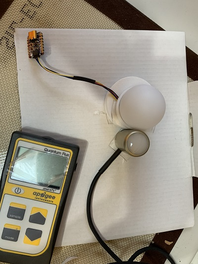
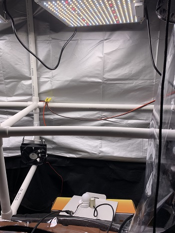

# System

# Hardware

# Calibration
To calibrate, the approach taken in the article, [_A Novel Approach to Obtain PAR with a Multi-Channel Spectral Microsensor_](https://pubmed.ncbi.nlm.nih.gov/34068029/) will be used.

A statistically significant number of samples will be fed into a multiple linear regression to find the slope intercept and coefficients.

$$ PPFD = b_0 + \sum_{i=1}^{n=8} (b_ix_i) + \epsilon $$

A sample consists of:
- reading the PPFD of a known reference - in this case an Apogee meter.
- readings from the 8 channels on the as7341 that are within the PAR range.


# Calibrator Prototype
To capture the channel values, I built a prototype consisting of:
- [Adafruit's AS7341 breakout board (BoB)](https://www.adafruit.com/product/4698)
- [Adafruit's QT Py ESP32-S2](https://www.adafruit.com/product/5325)
- a Ping Pong ball that acts as a diffuser.
- a 3D printed holder for the ping pong ball and the AS7341 BoB
- CircuitPython code loaded onto the QT PY:
    - [code.py](../CP_code/code.py)
    - [PAR_LIB.py](../CP_code/PAR_LIB.py)
- mqtt broker running on a Raspberry Pi.  The CP code in code.py publishes the channel readings to the mqtt broker which is picked up by a nodered flow.  The nodered flow stores the reading as a CSV line within a file on the Raspberry Pi.


## First Test
I used an LED light setup as my first test.



I did not change any settings on the AS7341 as set by [Adafruit's Circuitpython library](https://github.com/adafruit/Adafruit_CircuitPython_AS7341)
From looking at the defaults set in the [AS7341 CP library code](https://github.com/adafruit/Adafruit_CircuitPython_AS7341/blob/main/adafruit_as7341.py):
```
def initialize(self):
    """Configure the sensors with the default settings"""

    self._power_enabled = True
    self._led_control_enabled = True
    self.atime = 100
    self.astep = 999
    self.gain = Gain.GAIN_128X  # pylint:disable=no-member
```
### Observation
The LED on the AS7341 BoB maintained its eery green LED glow which I would think would alter the channel readings by including this light source.

### Results
```
2304,10226,10187,16548,24773,32891,35828,18372
16835,65535,65535,65535,65535,65535,65535,65535
15328,65535,60568,65535,65535,65535,65535,65535
13944,61563,55751,65535,65535,65535,65535,65535
12124,53645,49194,65535,65535,65535,65535,65535
9827,43549,40641,65535,65535,65535,65535,65535
```

