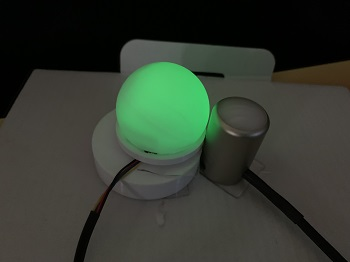

# System

# Hardware

# Calibration
To calibrate, the approach taken in the article, [_A Novel Approach to Obtain PAR with a Multi-Channel Spectral Microsensor_](https://pubmed.ncbi.nlm.nih.gov/34068029/) will be used.

A statistically significant number of samples will be fed into a multiple linear regression to find the slope intercept and coefficients.

$$ PPFD = b_0 + \sum_{i=1}^{n=8} (b_ix_i) + \epsilon $$

A sample consists of:
- reading the PPFD of a known reference - in this case an Apogee meter.
- readings from the 8 channels on the as7341 that are within the PAR range.


# Calibrator Prototype
To capture the channel values, I built a prototype consisting of:
- [Adafruit's AS7341 breakout board (BoB)](https://www.adafruit.com/product/4698)
- [Adafruit's QT Py ESP32-S2](https://www.adafruit.com/product/5325)
- a Ping Pong ball that acts as a diffuser.
- a 3D printed holder for the ping pong ball and the AS7341 BoB
- CircuitPython code loaded onto the QT PY:
    - [code.py](../CP_code/code.py)
    - [PAR_LIB.py](../CP_code/PAR_LIB.py)
- mqtt broker running on a Raspberry Pi.  The CP code in code.py publishes the channel readings to the mqtt broker which is picked up by a nodered flow.  The nodered flow stores the reading as a CSV line within a file on the Raspberry Pi.


## First Test
I used an LED light setup as my first test.


I did not change any settings on the AS7341 as set by [Adafruit's Circuitpython library](https://github.com/adafruit/Adafruit_CircuitPython_AS7341)
From looking at the defaults set in the [AS7341 CP library code](https://github.com/adafruit/Adafruit_CircuitPython_AS7341/blob/main/adafruit_as7341.py):
```
def initialize(self):
    """Configure the sensors with the default settings"""

    self._power_enabled = True
    self._led_control_enabled = True
    self.atime = 100
    self.astep = 999
    self.gain = Gain.GAIN_128X  # pylint:disable=no-member
```
### Observation
The LED on the AS7341 BoB maintained its eerie green LED glow which I would think would alter the channel readings by including this light source.


### Results
```
2304,10226,10187,16548,24773,32891,35828,18372
16835,65535,65535,65535,65535,65535,65535,65535
15328,65535,60568,65535,65535,65535,65535,65535
13944,61563,55751,65535,65535,65535,65535,65535
12124,53645,49194,65535,65535,65535,65535,65535
9827,43549,40641,65535,65535,65535,65535,65535
```
Many of the samples maxed out the value.  So there are two things I'll fix for the next test:
- Turn the green LED off.
- Change the interval time so the readings aren't maxed out due to oversaturation.

#### Turn off the Green LED
There are two LEDs on the BoB:
- a bright white which is be default off.  This can be turned on through the led property where sensor.led = True turns the LED on to a bright light.
- a green LED that is "hard wired" to the power circuit.  There is nothing I can find in the AS7341 library to turn this off.

The easiest way I thought of to turn the green LED off is to cover it with dark tape.
#### Getting readings that don't oversaturate
The ADC's Gain and Interval Time affect the values.
##### Gain and Interval Time
[The article that explores the AS7431 as a PAR meter](https://www.ncbi.nlm.nih.gov/pmc/articles/PMC8152513/) used the following settings:
_The ADC was configured with an integration time of 100 ms with a gain of four for all eight channels in the visible spectrum and a gain of one for the remaining IR channels. The settings are chosen in a way that the channel outputs are about half of the maximum possible count number on a cloud-less bright summer day._

According to the [AS7341 datasheet](https://ams.com/en/as7341), the interval time is calculated:
$$ t_{𝑖𝑛𝑡} = (𝐴𝑇𝐼𝑀𝐸 + 1) × (𝐴𝑆𝑇𝐸𝑃 + 1) × 2.78µ𝑠
$$
Given the AS7341 library's default,
interval time = (100 + 1) * (999 + 1 ) * 0.00278ms
= 101 * 2.78ms
= 280.78ms

###### Interval Time
OK.  So the current settings have a sampling time of 280.78 ms.  The article set the sampling time to 100ms, but doesn't tell us values for astep or atime.  I am a builder, not an expert, so given my current knowledge:
- astep points to the resolution of readings when converting an analog to digital value (i.e.: the number of voltage steps).  The larger the astep, the higher the resolution.  
- atime points to the actual time it takes to mungle about with the sample.

I have two unknowns.  I'll set the astep to 599.  The interval time is 100ms so we have:
```
100 = (ATIME + 1) * 600 * 0.00278
100/(600 * 0.00278) = 60
ATIME = 59

100 = 60 * 600 * 0.0028 = 108
```
sensor.atime = 59 sensor.astep = 599
###### Gain
The default gain is 128x.  The article set the gain for the visible channels to a gain of 4x.
sensor.gain = sensor.gain.GAIN_4X
### New Results
New results are within ranges that can be sampled:
```
3152,17180,6920,18764,28643,26845,21375,11130
4070,21699,8381,24061,37087,34443,26972,13683
8259,38644,13648,46921,52489,48042,36851,16561
```
