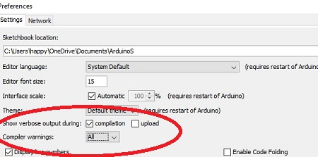

# The Arduino Abstraction Causes Challenges
The Arduino IDE mapping to the ESP32 is not without it's challenges.  On this page, I detail the mapping challenges I have run accross and what I did to change the challenges into opportunities.
## Menu Access to ESP32 debugging and Partitioning
Each board manufacturer is responsible for the exposure of features such as partitioning (needed for OTA) and ESP32 debugging.  I have been using the AI Thinker ESP32-CAM for several projects based on Googled recommendations.  The challenge with this is the AI Thinker's boards.txt entry does not have all the goodies other boards have.  Here's the AI Thinker board menu:


Here's other ESP32's board menu:


The other boards have cool options like partitioning for OTA, Core Debug logging...OOOHH!

I found an [Arduino Stack Exchange article](https://arduino.stackexchange.com/questions/75198/why-doesnt-ota-work-with-the-ai-thinker-esp32-cam-board) that added these features in for the AI Thinker.  So far it seems to work...

It requires finding the location of the boards.txt file.  The easiest way to find the location is to go to preferences within the Arduino IDE and check the verbose compiler output.  My location is:
```
C:\Users\happy\AppData\Local\Arduino15\packages\esp32\hardware\esp32\1.0.6\boards.txt
```
Then follow the instructions in the article to change the info within the AI Thinker board definition in the file to:
```
##############################################################

esp32AiThinkerCam.name=ESP32 AI Thinker Cam

esp32AiThinkerCam.upload.tool=esptool_py
esp32AiThinkerCam.upload.maximum_size=1310720
esp32AiThinkerCam.upload.maximum_data_size=327680
esp32AiThinkerCam.upload.wait_for_upload_port=true

esp32AiThinkerCam.serial.disableDTR=true
esp32AiThinkerCam.serial.disableRTS=true

esp32AiThinkerCam.build.mcu=esp32
esp32AiThinkerCam.build.core=esp32
esp32AiThinkerCam.build.variant=esp32
esp32AiThinkerCam.build.board=ESP32_DEV

esp32AiThinkerCam.build.f_cpu=240000000L
esp32AiThinkerCam.build.flash_size=4MB
esp32AiThinkerCam.build.flash_freq=40m
esp32AiThinkerCam.build.flash_mode=dio
esp32AiThinkerCam.build.boot=dio

esp32AiThinkerCam.menu.CPUFreq.240=240MHz (WiFi/BT)
esp32AiThinkerCam.menu.CPUFreq.240.build.f_cpu=240000000L
esp32AiThinkerCam.menu.CPUFreq.160=160MHz (WiFi/BT)
esp32AiThinkerCam.menu.CPUFreq.160.build.f_cpu=160000000L
esp32AiThinkerCam.menu.CPUFreq.80=80MHz (WiFi/BT)
esp32AiThinkerCam.menu.CPUFreq.80.build.f_cpu=80000000L

esp32AiThinkerCam.build.partitions=default
esp32AiThinkerCam.build.defines=-DBOARD_HAS_PSRAM -mfix-esp32-psram-cache-issue
esp32AiThinkerCam.menu.PartitionScheme.default=Default 1.2MB APP/1.5MB SPIFFS (OTA)
esp32AiThinkerCam.menu.PartitionScheme.default.build.partitions=default
esp32AiThinkerCam.menu.PartitionScheme.defaultffat=Default FATFS 1.2MB APP/1.5MB FATFS (OTA)
esp32AiThinkerCam.menu.PartitionScheme.defaultffat.build.partitions=default_ffat
esp32AiThinkerCam.menu.PartitionScheme.noota_3g=1MB APP/3MB SPIFFS (No OTA)
esp32AiThinkerCam.menu.PartitionScheme.noota_3g.build.partitions=noota_3g
esp32AiThinkerCam.menu.PartitionScheme.noota_3g.upload.maximum_size=1048576
esp32AiThinkerCam.menu.PartitionScheme.no_ota=2MB APP/2MB SPIFFS (No OTA)
esp32AiThinkerCam.menu.PartitionScheme.no_ota.build.partitions=no_ota
esp32AiThinkerCam.menu.PartitionScheme.no_ota.upload.maximum_size=2097152
esp32AiThinkerCam.menu.PartitionScheme.huge_app=3MB APP/1MB SPIFFS (No OTA)
esp32AiThinkerCam.menu.PartitionScheme.huge_app.build.partitions=huge_app
esp32AiThinkerCam.menu.PartitionScheme.huge_app.upload.maximum_size=3145728
esp32AiThinkerCam.menu.PartitionScheme.noota_ffat=2MB APP/2MB FATFS (No OTA)
esp32AiThinkerCam.menu.PartitionScheme.noota_ffat.build.partitions=noota_ffat
esp32AiThinkerCam.menu.PartitionScheme.noota_ffat.upload.maximum_size=2097152
esp32AiThinkerCam.menu.PartitionScheme.noota_3gffat=1MB APP/3MB FATFS (No OTA)
esp32AiThinkerCam.menu.PartitionScheme.noota_3gffat.build.partitions=noota_3gffat
esp32AiThinkerCam.menu.PartitionScheme.noota_3gffat.upload.maximum_size=1048576
esp32AiThinkerCam.menu.PartitionScheme.minimal=Min SPIFFS 1.3MB APP/700KB SPIFFS (OTA)
esp32AiThinkerCam.menu.PartitionScheme.minimal.build.partitions=minimal
esp32AiThinkerCam.menu.PartitionScheme.min_spiffs=Med SPIFFS 1.9MB APP/190KB SPIFFS (OTA)
esp32AiThinkerCam.menu.PartitionScheme.min_spiffs.build.partitions=min_spiffs
esp32AiThinkerCam.menu.PartitionScheme.min_spiffs.upload.maximum_size=1966080


esp32AiThinkerCam.menu.FlashMode.qio=QIO
esp32AiThinkerCam.menu.FlashMode.qio.build.flash_mode=dio
esp32AiThinkerCam.menu.FlashMode.qio.build.boot=qio
esp32AiThinkerCam.menu.FlashMode.dio=DIO
esp32AiThinkerCam.menu.FlashMode.dio.build.flash_mode=dio
esp32AiThinkerCam.menu.FlashMode.dio.build.boot=dio
esp32AiThinkerCam.menu.FlashMode.qout=QOUT
esp32AiThinkerCam.menu.FlashMode.qout.build.flash_mode=dout
esp32AiThinkerCam.menu.FlashMode.qout.build.boot=qout
esp32AiThinkerCam.menu.FlashMode.dout=DOUT
esp32AiThinkerCam.menu.FlashMode.dout.build.flash_mode=dout
esp32AiThinkerCam.menu.FlashMode.dout.build.boot=dout

esp32AiThinkerCam.menu.FlashFreq.80=80MHz
esp32AiThinkerCam.menu.FlashFreq.80.build.flash_freq=80m
esp32AiThinkerCam.menu.FlashFreq.40=40MHz
esp32AiThinkerCam.menu.FlashFreq.40.build.flash_freq=40m

esp32AiThinkerCam.menu.UploadSpeed.921600=921600
esp32AiThinkerCam.menu.UploadSpeed.921600.upload.speed=921600
esp32AiThinkerCam.menu.UploadSpeed.115200=115200
esp32AiThinkerCam.menu.UploadSpeed.115200.upload.speed=115200
esp32AiThinkerCam.menu.UploadSpeed.256000.windows=256000
esp32AiThinkerCam.menu.UploadSpeed.256000.upload.speed=256000
esp32AiThinkerCam.menu.UploadSpeed.230400.windows.upload.speed=256000
esp32AiThinkerCam.menu.UploadSpeed.230400=230400
esp32AiThinkerCam.menu.UploadSpeed.230400.upload.speed=230400
esp32AiThinkerCam.menu.UploadSpeed.460800.linux=460800
esp32AiThinkerCam.menu.UploadSpeed.460800.macosx=460800
esp32AiThinkerCam.menu.UploadSpeed.460800.upload.speed=460800
esp32AiThinkerCam.menu.UploadSpeed.512000.windows=512000
esp32AiThinkerCam.menu.UploadSpeed.512000.upload.speed=512000

esp32AiThinkerCam.menu.DebugLevel.none=None
esp32AiThinkerCam.menu.DebugLevel.none.build.code_debug=0
esp32AiThinkerCam.menu.DebugLevel.error=Error
esp32AiThinkerCam.menu.DebugLevel.error.build.code_debug=1
esp32AiThinkerCam.menu.DebugLevel.warn=Warn
esp32AiThinkerCam.menu.DebugLevel.warn.build.code_debug=2
esp32AiThinkerCam.menu.DebugLevel.info=Info
esp32AiThinkerCam.menu.DebugLevel.info.build.code_debug=3
esp32AiThinkerCam.menu.DebugLevel.debug=Debug
esp32AiThinkerCam.menu.DebugLevel.debug.build.code_debug=4
esp32AiThinkerCam.menu.DebugLevel.verbose=Verbose
esp32AiThinkerCam.menu.DebugLevel.verbose.build.code_debug=5
```
## ESP32 Logging To Other I/Os
There is a function within ESP32 logging that allows the code to provide a callback to be called whenever a log is to be written.  This will include the logs written to the Serial port when the different components are being used.
```
esp_log_set_vprintf(&vprintf_into_telnet);
```
AWESOME! Right?  Hmmm...the challenge is without some jiggling of the Arduino IDE bits, this wonderful function is not usable by us Arduino IDE folks!  Bummer.. But let us not despair...We can do this..

The ESP32 has builtin logging features that aren't completely exposed as noted in
[this article on ESP32 Arduino debugging](https://thingpulse.com/esp32-logging/).  The challenge is Arduino debugging assumes the serial port and there aren't really debugging levels.  What we want to do is access the ESP32's logging feature, particularly the one that lets us send debugging output to any io - telnet, SPIFFS, FTP...
### Turn on USE_ESP_IDF_LOG 1
The `esp32-hal-log.h` file is where the developer of the ESP32's Arduino logging abstraction is defined.  The contents of this file needs to be modified to include
```
#define USE_ESP_IDF_LOG 1
```
The location of the file can be found by turning on verbose compilation.  I also allow all compiler warnings to be seen:



My location is:
```
C:\Users\happy\AppData\Local\Arduino15\packages\esp32\hardware\esp32\1.0.6\cores\esp32
```
The modification is near the beginning of the file:
```
#include "sdkconfig.h"

//-------- MJ CHANGED FOR REDIRECTING LOGGING
#define USE_ESP_IDF_LOG 1

#define ARDUHAL_LOG_LEVEL_NONE       (0)
#define ARDUHAL_LOG_LEVEL_ERROR      (1)
```
_Note: This caused several compile time warnings.:_
```
\1.0.6\cores\esp32\HardwareSerial.cpp:36:9: note: in expansion of macro 'log_e'
         log_e("Serial number is invalid, please use 0, 1 or 2");
\1.0.6\cores\esp32\esp32-hal-log.h:144:84: warning: ISO C++ forbids converting a string constant to 'char*' [-Wwrite-strings]
 #define log_e(format, ...) do {log_to_esp(TAG, ESP_LOG_ERROR, format, ##__VA_ARGS__);}while(0)
                                                                                    
\1.0.6\cores\esp32\HardwareSerial.cpp:73:13: note: in expansion of macro 'log_e'
             log_e("Could not detect baudrate. Serial data at the port must be present within the timeout for detection to be possible");
             ^
```
### Write The Callback Routine
The callback routine can then send the buffer containing the logging info to wherever it wants.  Examples:
- [Send log entries read by netcat clients](https://github.com/solarslurpi/GrowBuddy/blob/baa5c824cfbea5044d78e7a0d5f6da21422d0fd5/camBuddy_code/camBuddy/ESP32_UDP_log_test.ino)
- [Write log entries to SPIFFS](https://github.com/solarslurpi/GrowBuddy/blob/baa5c824cfbea5044d78e7a0d5f6da21422d0fd5/camBuddy_code/camBuddy/ESP32_SPIFFS_log_test.ino)
- [Send log entries to telnet client](https://github.com/solarslurpi/GrowBuddy/blob/baa5c824cfbea5044d78e7a0d5f6da21422d0fd5/camBuddy_code/camBuddy/ESP32_telnet_log_test.ino)
- [Send log entries to an ftp client](https://github.com/solarslurpi/GrowBuddy/blob/f8e55002a1ca270cd2a9fdbca008b937a5111404/camBuddy_code/camBuddy/ESP32_ftp_log.ino)